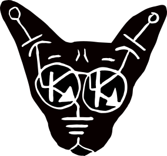

# Rob the fiddler

  

# Rob the fiddler

 

# About Me

# Featured Projects

## Arduino Component Sketches

[ACS](https://github.com/robstave/ArduinoComponentSketches)

Collection of sketches for ATTiny to replace logic blocks in lunetta like circuits or whatever.

I really like to make things blink and go beep.  A LOT of sketches that do that.  Mostly for ATTINY85 but a few other chips are supported.  Its arduino code, so most sketches can be refactored pretty easily.

 

## ATTINY85 Latex Builder

[Latex builder](https://github.com/robstave/attiny85-latex)

Create cool Latex ATTINY85 Pinouts from json files.  The intent was to automate the images that I use in the above repo.   I got the tool working.  But remaking all the images still is a chore that will take some time to get around too doing.

 

# Other Smaller Learning projects

These are more just exercises and trivial pursuits.

## D3 mitre attack widget

[D3 Mitre exercise](https://github.com/robstave/d3-mitre-ai-experiment)

An attempt to see just how little code I actually needed to write using ChatGPT.  Turns out...practically none!

I had it build a D3 widget interatively without manually changing any code.  Just a conversation ( and a little copy/paste into JS fiddle )

 
 

## RTO

[Return to Office Calculator](https://github.com/robstave/rto)

 

